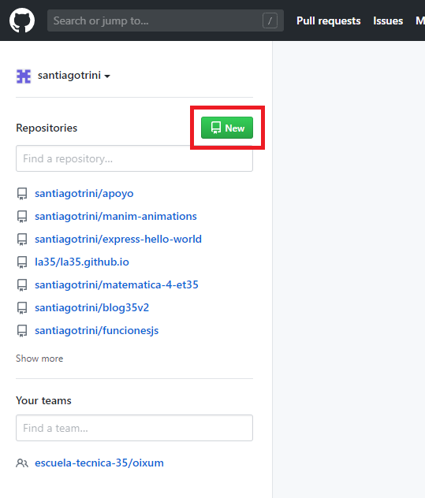
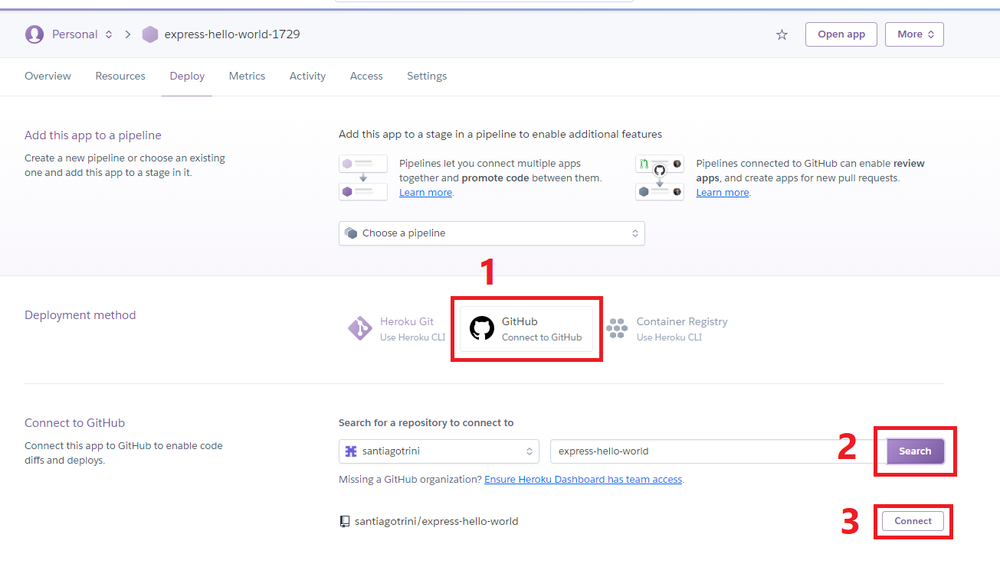

# Express Hello World

Introducción al desarrollo web _full stack_ con JavaScript.

## Requisitos

- Una compu preferentemente con Linux, pero también se puede hacer en Windows / macOS.
- Una conexión a Internet. Para dos cosas, bajar librerías que vamos a utilizar y para subir (_hostear_) las apps que vamos a desarrollar.
- Un editor de texto: Atom, VSCode, Sublime Text o Vim para los más valientes.
- NodeJS, un entorno de ejecución de JavaScript. Bajar desde https://nodejs.org/es/.
- Git, un VCS (_version control system_). Bajar desde https://git-scm.com/.
- Una cuenta en GitHub, https://github.com/.
- Una cuenta en Heroku, https://www.heroku.com/.
- Heroku CLI (opcional pero muy útil). Bajar desde https://devcenter.heroku.com/articles/heroku-cli.
- Una cuenta en MongoDB Atlas, https://www.mongodb.com/cloud/atlas.
- Un server de MongoDB. Bajar desde https://www.mongodb.com/try/download/community.
- Un server de PostgreSQL. Bajar desde https://www.postgresql.org/.

**Nota:** los últimos tres requisitos son para trabajar con bases de datos (tanto SQL como NoSQL), no son urgentes para empezar. Voy a aclarar en la guía cuando se necesite conexión a Internet. Todos los requisitos de la lista de arriba son gratuitos, si alguno les pide tarjeta de crédito están en el lugar equivocado, las cuentas de GitHub, MongoDB Atlas y Heroku incluídas.

## Algunas convenciones antes de arrancar

Cuando les pido ejecutar comandos en la terminal van a ver algo como esto.

```
$ mkdir hello-world
$ cd hello-world
$ npm init -y
```

El signo `$` ahí está para indicar que eso se ejecuta en la terminal, pero no se escribe. No es capricho mío, es una convención aceptada por todo el mundo. Cada vez que voy a una nueva línea significa que presionamos `Enter`. Por favor no quiero ver a nadie en diciembre copiando el signo `$`.

En general los comandos para la terminal en Windows y en Linux son los mismos, en los casos que no lo sean lo voy a aclarar.

Por otro lado, cuando haya que escribir código (casi siempre en JavaScript) voy a poner en un comentario el nombre del archivo al que le pertenece como en el siguiente ejemplo. El lenguaje se infiere de la extensión del archivo.

```js
// index.js
const express = require('express');

const port = 3000;
```

## Fijarse que todo ande antes de arrancar

Verificar que NodeJS, npm y Git se puedan usar desde la terminal.

```
$ node -v
v14.3.0
$ npm -v
6.14.5
$ git --version
git version 2.27.0
```

Si ven los números de versión está todo bien.

Lista de cosas antes de arrancar:

- [x] Navegador web (Chrome, Firefox)
- [ ] Saber entrar a la terminal (cmd o bash)
- [ ] NodeJS instalado
- [ ] Git instalado
- [ ] Heroku CLI instalado
- [ ] Cuenta en GitHub
- [ ] Cuenta en Heroku
- [ ] Un editor de texto decente

## Crear un proyecto de NodeJS

Empezamos entonces, creamos una carpeta para nuestro proyecto. Nos vamos a esa carpeta y le decimos a Git que la trate como a un repositorio. También creamos el `package.json` con npm. Todo eso con los siguientes comandos.

```
$ mkdir express-hello-world
$ cd express-hello-world
$ git init
$ npm init -y
```

## Agregar Express y el .gitignore

Ahora hacemos dos cosas, agregamos un archivo llamado `.gitignore` para que Git ignore la carpeta `node_modules`. Esa carpeta se crea cuando instalamos librerias con npm. En nuestro caso vamos a instalar Express (requiere Internet).

```
$ echo node_modules > .gitignore
$ npm install express
```

## Creamos el index.js y agregamos código

Creamos un archivo llamado `index.js`. En Linux:

```
$ touch index.js
```

En Windows:

```
$ type nul > index.js
```

Abrimos este archivo y tipeamos el siguiente código. Los comentarios explican brevemente cada parte. La app no se puede hacer más básica que esto.

```js
// index.js

// importa la libreria express
const express = require('express');

// crea el objeto app
const app = express();

// la app responde con Hello world
// a todas las peticiones GET a /
app.get('/', (req, res) => {
  res.send('Hello world');
});

// el server escucha en el puerto 3000
app.listen(3000);
```

## Modificamos el package.json y probamos que ande todo

Abrimos el `package.json` y agregamos una propiedad llamada `start` a la parte de scripts. Quedaría así.

```json
{
  "name": "express-hello-world",
  "version": "1.0.0",
  "description": "",
  "main": "index.js",
  "scripts": {
    "start": "node index.js",
    "test": "echo \"Error: no test specified\" && exit 1"
  },
  "keywords": [],
  "author": "",
  "license": "ISC",
  "dependencies": {
    "express": "^4.17.1"
  }
}
```

Para probar que todo funcione ejecutamos nuestra app en la terminal.

```
$ npm start
```

Y nos vamos a http://localhost:3000 en el navegador web. Deberíamos ver el "Hello world".

## Subiendo la app a Internet

Ya tenemos la app funcionando localmente, podemos seguir desarrollando localmente y agregarle cosas a la app. O podemos subirla a Internet. Vamos por la segunda opción.
A partir de acá por razones obvias necesitamos Internet.

Primero nos vamos a https://github.com y nos logeamos. Nos recibe un _dashboard_.
Creamos un repositorio nuevo.



Elegimos un nombre y lo demás lo dejamos por defecto.


El de este ejemplo va a ser `usuario/express-hello-world`. En `usuario` cada uno va a tener su nombre de usuario por supuesto.

Tomamos nota del link del repo que nos muestra la siguiente pantalla, ese es el que vamos a usar en el comando `git remote add origin`.


De vuelta en la terminal hacemos lo siguiente en la carpeta del proyecto.

```
$ git remote add origin https://github.com/usuario/express-hello-world.git
$ git add .
$ git commit -m "primer commit"
```

Si cuando ejecutan `git commit` les pregunta quienes son y no hace el commit configuren su nombre y mail con los siguientes comandos. Después de ejecutar los dos `git config` ejecuten devuelta el `git commit` porque la primera vez no lo procesó.

```
$ git config --global user.name "Nombre Apellido"
$ git config --global user.mail "nombre@mail.com"
```

Por último suben el código a GitHub con `git push`

```
$ git push -u origin master
```

Les va a pedir usuario y contraseña de GitHub. Cuando termine vayan a https://github.com/usuario/express-hello-world y deberían ver su código.

## Actualizando el código para Heroku

Ya casi estamos, para que esta app esté funcionando desde Heroku modificamos un par de cosas antes de hacer nuestro primer _deploy_.

El `index.js` quedaría así ahora:

```js
// index.js

// importa la libreria express
const express = require('express');

// ponemos el puerto del server en una variable
const port = process.env.PORT || 3000;

// crea el objeto app
const app = express();

// la app responde con Hello world
// a todas las peticiones GET a /
app.get('/', (req, res) => {
  res.send('Hello world');
});

// el server escucha en el puerto 3000
app.listen(port);
```

Agregamos un archivo llamado `Procfile` con el texto `web: npm start` en la carpeta del proyecto.

```
$ echo web: npm start > Procfile
```

Subimos estas modificaciones a nuestro repositorio en GitHub. A partir de ahora no hace falta usar `git push -u origin master`, con `git push` a secas alcanza.

```
$ git add .
$ git commit -m "modificaciones para Heroku"
$ git push
```

## Creamos una app en Heroku

Acá tenemos dos opciones, usar la CLI de Heroku o usar la interfaz web (el dashboard) que aparece cuando nos logeamos en la web de Heroku. Hasta el momento la única manera que conozco de linkear el repo de GitHub con Heroku es en la interfaz web así que vamos a https://heroku.com, nos logeamos y le damos al boton "new" en la esquina superior derecha para crear una app.


Elegimos un nombre y le damos al botón de crear app.


## Deploy automático desde GitHub

Nos aparece un panel de control de la nueva app. En la pestaña de "Deploy", en la sección "Deployment method" elegimos GitHub y conectamos nuestra cuenta de GitHub a Heroku.



Luego activamos los deploys automáticos desde GitHub y hacemos un deploy manual. Listo, la app está online. Usen el botón de "View" para ver como quedó. O en el navegador ponemos https://express-hello-world-1729.herokuapp.com (reemplazar por el nombre de su app).


## Probemos de mostrar algo de HTML desde la app

A partir de ahora cada vez que cambiemos algo en nuestro proyecto primero lo probamos localmente en nuestra computadora. Si estamos conformes realizamos un commit y lo subimos a GitHub. Lo que esté en el repo de GitHub es lo que está online en Heroku, están sincronizados.

Hagamos la prueba, en vez de mostrar "Hello world" pongamos un poco de HTML en nuestra app de Express.

Vamos a `index.js` y agregamos una línea de código, quedaría de esta manera el archivo ahora.

```js
// index.js

// importa la libreria express
const express = require('express');

// ponemos el puerto del server en una variable
const port = process.env.PORT || 3000;

// crea el objeto app
const app = express();

// agregamos esta línea
app.use(express.static('public'));

// la app responde con Hello world
// a todas las peticiones GET a /
app.get('/', (req, res) => {
  res.send('Hello world');
});

// el server escucha en el puerto 3000
app.listen(port);
```

Agregamos una carpeta llamada `public` a nuestro proyecto y dentro de `public` un archivo `index.html`.

```
$ mkdir public
$ cd public
$ touch index.html
```

En Windows recuerden reemplazar `touch archivo` por `type nul > archivo`.

Agregamos algo de código en `index.html`.

```html
<!DOCTYPE html>
<html>
  <head>
    <meta charset="utf-8">
  </head>
  <body>
    <h1>Mi primer app</h1>
    <p>Lorem ipsum sit dolor amet...</p>
    <hr>
    <h2>Estoy aprendiendo</h2>
  </body>
</html>
```

Listo, probamos que todo ande ejecutando el server.

```
$ npm start
```

Y chequeamos que todo esté bien en http://localhost:3000. Si estamos conformes hacemos un _commit_ y un _push_ al remoto (GitHub).

```
$ git add .
$ git commit -m "agrega index.html"
$ git push
```

En un par de minutos se actualiza la app en Heroku y listo, podemos ver los cambios en https://nombre-de-la-app.herokuapp.com.

## Pero no necesito todo esto para poner algo de HTML en la web

Más vale que no, les muestro una manera más fácil y rápida pero mejor lo leen en otro README. En este repo https://github.com/santiagotrini/hello-gh-pages les muestro como poner online un sitio estático de una manera más fácil y rápida.

Heroku está pensado para hostear todo tipo de aplicaciones web, GitHub Pages es una manera rápida de hostear sitios estáticos, mucho más limitados.

## Muy bonito todo, pero este ejemplo es una pavada

Bueno, paso a paso, para la próxima hacemos un https://github.com/santiagotrini/hello-database y conectamos una base de datos a nuestra app de Express. Este es el principal motivo para separar nuestra aplicación web en _backend_ y _frontend_.

## No entendí nada. ¿Dónde puedo aprendar más?

Bueno, ya que preguntan les dejo material de lectura.

- Libro online sobre Git y algo de GitHub. https://git-scm.com/book/es/v2/.
- MDN (Mozilla developer network). Mucho material y tutoriales de desarrollo web, la mayor parte está traducida al español. https://developer.mozilla.org/es/docs/Learn.
- La web oficial de Express tiene una guía de uso y una muy buena documentación (referencia). https://expressjs.com/es/starter/installing.html.
- GitHub tiene su documentación en https://help.github.com/es.
- Heroku tiene su web de ayuda y tutoriales, pero está en inglés solamente. Por algo les digo que les conviene aprender inglés. https://devcenter.heroku.com/.
